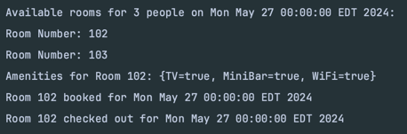

# Room Management System (Learning Project)
### Intention of the project
To learn and prep about various concepts in core Java, OOPS concepts, SOLID principles and Design patterns(Singleton, Builder, Factory).

### Project Statement
The Room Management System project is designed to handle hotel room operations, including checking room availability, displaying amenities, booking rooms, and checking out rooms. It incorporates various object-oriented principles and design patterns to ensure a flexible and maintainable codebase.

**Key Functionalities**:
1. **Check Room Availability**: Determine available rooms based on the number of people and a specific date.
2. **Display Room Amenities**: Show amenities for a specific room before booking.
3. **Book a Room**: Reserve a room for a specific date.
4. **Check Out Room**: Mark a room as checked out for a specific date.
5. **Add Rooms**: Reception can add new rooms with specific configurations.

**Design Patterns and Principles**:
- **Singleton Pattern**: Ensures only one instance of the `Reception` class exists. Improved singleton leveraging by using Bill Pugh implemnetaion(static fields are initialized in a thread-safe manner,The reception field in ReceptionHelper is initialized when the class is loaded, which is handled by the Java ClassLoader) making it simple, performant and thread safe.
- **Builder Pattern**: Facilitates the creation of complex `Room` objects with various amenities and configurations.
- **Factory Pattern**: Creates different types of `Room` objects (`StandardRoom`, `DeluxeRoom`, `SuiteRoom`) based on input.
- **DAO Pattern**: Manages booking data through file operations, abstracting data access logic into the `BookingDAO` class.

**OOPS Concepts**:
- **Abstract Class**: Abstract classes provide a way to define a common base class that cannot be instantiated on its own but can provide common functionality for derived classes. here `Room` is an abstract class that defines the common properties and methods for different room types. 
- **Inheritance**: Inheritance allows a class to inherit properties and methods from another class, promoting code reuse. Here `StandardRoom`, `DeluxeRoom`, and `SuiteRoom` inherit from the `Room` abstract class.
- **Composition**: implies a strong ownership where the lifetime of the contained object depends on the lifetime of the container object. If the container object is destroyed, the contained objects are also destroyed. 
   example of how its used in this project 
  - **The `Reception` class contains an instance of `BookingDAO`. The `BookingDAO` instance is created and managed by the `Reception` class. If the `Reception` instance is destroyed, the `BookingDAO` instance will also be destroyed**
  - **The `Room` class uses a `RoomBuilder` to build its instances. The `RoomBuilder` is not used outside the scope of building a `Room`, which implies a strong relationship where the builder is part of the creation process of the `Room`.** 
- **Aggregation**: implies a weaker relationship where the contained objects can exist independently of the container object. The lifetime of the contained objects does not depend on the lifetime of the container object.
    example of how this is used in this project.
  - **The `Reception` class maintains a list of `Room` objects. These rooms can exist independently of the `Reception`. If the `Reception` is destroyed, the rooms themselves are not destroyed;**
- **Polymorphism**: Polymorphism enables a single interface to represent different underlying forms (data types). It allows methods to be used interchangeably on objects of different types that share a common base class or interface. Here Allows the `Reception` class to handle different room types through a common `Room` interface.
- **Interfaces**: Interfaces define a contract that implementing classes must fulfill, promoting a separation of concerns and enabling polymorphism. Here `IReception` interface defines the contract for the Reception class.

**SOLID Principles**:
- **Single Responsibility Principle**: Each class has a single responsibility. For instance, BookingDAO is solely responsible for handling file operations related to bookings.
- **Open/Closed Principle**: The system is open for extension but closed for modification. New room types can be added by extending the Room class without modifying existing code.
- **Liskov Substitution Principle**: Instances of subclasses (`StandardRoom`, `DeluxeRoom`, `SuiteRoom`) can be used interchangeably with instances of the superclass (`Room`).
- **Interface Segregation Principle**: Interfaces are kept small and specific. IReception provides a specific contract for reception-related operations.
- **Dependency Inversion Principle**:High-level modules (`Reception`) do not depend on low-level modules (`BookingDAO`), but rather on abstractions (interfaces).

**Java Concepts**:
- **Generics**: There is a generic type declaration for the inner static abstract class `RoomBuilder`. `T extends RoomBuilder<T>`, here `T` represents the type of the concrete builder and ensures that the type `T` is a subclass of `RoomBuilder<T>`. It enables fluent method chaining by allowing methods in RoomBuilder to return `T`. Here `T` can be `SuiteRoom`, `StandardRoom`, `DeluxeRoom` which extends `Room`.

**File Operations**:
- Bookings are stored in a CSV file, and the system checks this file for availability before booking. The `BookingDAO` class handles reading and writing to the CSV file, ensuring data persistence.

**Demo**  

